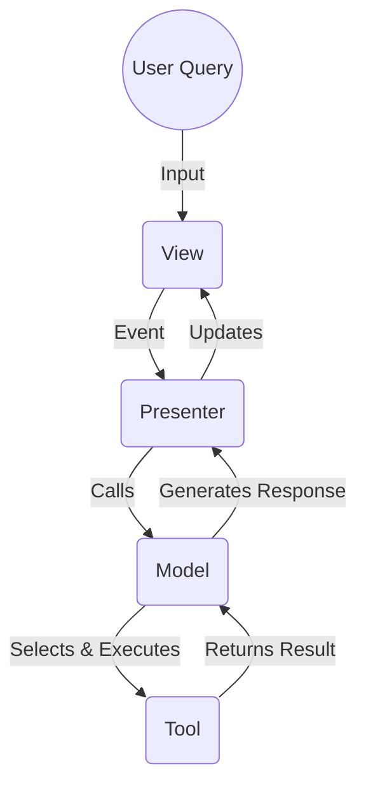

# ACE Architecture Overview

## How ACE Works
ACE operates using a modern Large Language Model (LLM) architecture with Tool-Calling capabilities, allowing it to move beyond simple chat and perform complex, real-world actions.

1. **Receives the Query & Context:** You submit a prompt (e.g., "What is the time right now?"). The LLM reads your request along with the entire prior conversation history (the context) to understand your intent.

2. **Intelligent Tool Selection:** The LLM automatically determines if one of the application's available Tools is required. For the time query, it identifies the `get_date_time` tool and extracts any relevant parameters.

3. **Executes the Action:** The system momentarily pauses the chat to call the corresponding Tool class's `execute()` method (e.g., `ClockTool().execute(format="time")`), capturing the raw result.

4. **Formulates and Delivers the Answer:** The raw tool output is sent back to the LLM, which then processes it and formats it into a polite, polished, and persona-aligned response for display in your interface.

## Core Components
| Component               | Role                                  |
|-------------------------|----------------------------------------------|
| **main.py**              | The entry point of the application that initialises the ACE framework and starts the assistant. |
| **core/models**         | The **Intelligence Layer**. Contains `GeminiIntelligenceModel` (powered by the Gemini API) and the simpler `MinimumViableModel`. Implements the three-pass tool-calling loop: Intent → Execution → Synthesis. |
| **core/views**          | The **Presentation Layer**. Contains the `ConsoleView` for command-line interaction and can be extended to include other interfaces (e.g., web, desktop). |
| **core/presenters**     | The **Orchestrator**. Contains `ConsolePresenter`, which mediates between the View and the Model, reacting to view events and driving the application loop. |
| **core/adapters**       | The **Integration Layer**. Contains adapters that facilitate communication between ACE and external systems, such as APIs or databases. |
| **core/services**       | The **Service Layer**. Contains services that orchestrate adapters to perform specific tasks, such as fetching weather data or managing user sessions. |
| **core/tools**          | The **Tool Layer**. Contains reusable tools that can be invoked by the Model to perform specific actions, such as retrieving the current time or fetching weather information. |

## System Architecture Diagram
